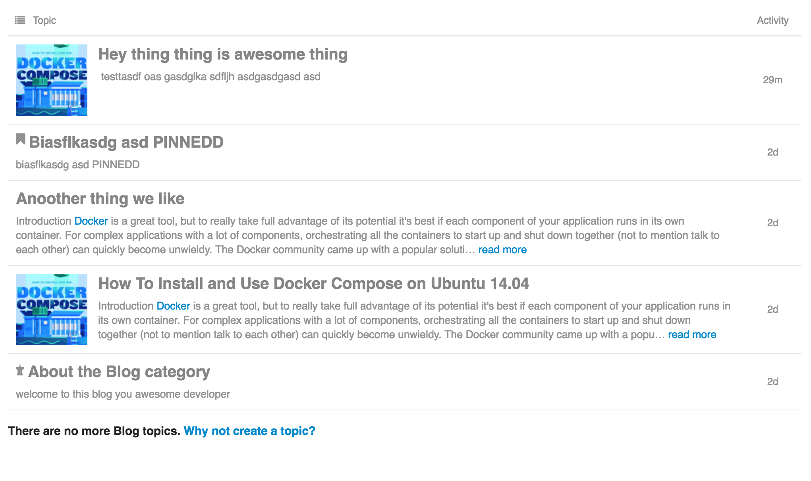

# Discourse Blog Category

Special case settings for `blog` category.

## Features

1. 400 char length excerpts for all topics
2. Topics ordered by `created`
3. `user`, `replies`, and `views` hidden
4. Square thumbnails from primary post image

## Usage

Simply create a category called `Blog` with slug `blog`, install this plugin and done.

## Installation

To install using docker, add the following to your `app.yml` in the plugins section:

    hooks:
      after_code:
        - exec:
            cd: $home/plugins
            cmd:
              - git clone https://github.com/tideaccount/tide-discourse-blog.git

and rebuild your docker via

    cd /var/discourse
    ./launcher rebuild app

## License

Copyright 2016, Starfish Platform Limited.
